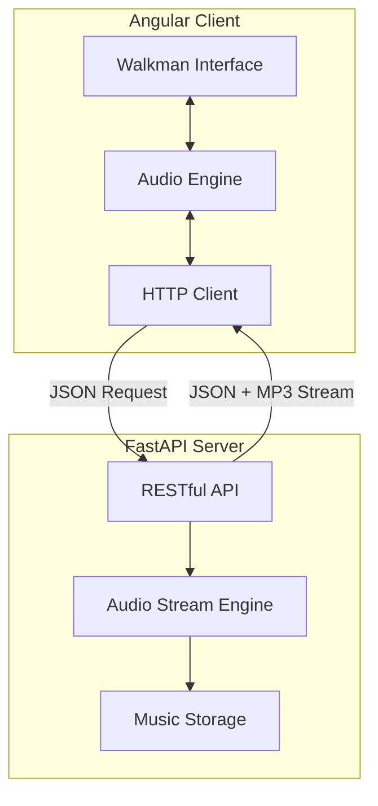

WAYNE.MP3
Retro Soul. Modern Code. Pure Sound.
🇹🇭 ภาษาไทย

WAYNE.MP3 คือ Full-stack Music Web Application ที่ผสมผสานกลิ่นอายยุค 90s/Y2K เข้ากับ modern software architecture เพื่อสร้างประสบการณ์การฟังเพลงที่มากกว่าแค่ “กดเล่น”

โปรเจกต์นี้ได้รับแรงบันดาลใจจาก Sony Walkman และงานภาพของ Wong Kar-wai โดยนำความ nostalgic, cinematic, และ emotional design มาผสานเข้ากับเทคโนโลยี Full-stack สมัยใหม่

WAYNE.MP3 ไม่ได้ถูกสร้างขึ้นเพื่อเป็นเพียง music player
แต่มันคือการทดลองว่า Design + Sound + Software Engineering สามารถอยู่ร่วมกันได้อย่างลงตัว

“หยิบ Walkman จากปี 1997 แล้วเสียบเข้ากับ Internet ปี 2026” 📼⚡

✨ Tech Stack
🎛 Frontend
Angular + TypeScript
Custom Audio Controller
Real-time Seek Bar
Dynamic Volume Management
Responsive UI Design
⚡ Backend
FastAPI + Python
RESTful API
Async Processing
Low-latency Audio Streaming
Clean API Architecture
🎧 ความสามารถหลัก
เล่นเพลงแบบ Real-time
Seek เพลงแบบ Sync ทันที
จัดการ Playlist
Streaming ผ่าน RESTful API
UI ได้แรงบันดาลใจจาก Walkman
Architecture แยก Frontend / Backend ชัดเจน
🇺🇸 English

WAYNE.MP3 is a full-stack music web application that blends 90s/Y2K aesthetics with modern software architecture to create a listening experience beyond simply pressing play.

Inspired by the iconic Sony Walkman and the cinematic visual language of Wong Kar-wai, this project combines nostalgia, emotion, and technology into one interactive platform.

WAYNE.MP3 was not built to be just another music player.
It is an experiment proving that Design + Sound + Software Engineering can coexist beautifully.

“A Walkman from 1997, plugged into the internet of 2026.” 📼⚡

✨ Tech Stack
🎛 Frontend
Angular + TypeScript
Custom-built Audio Controller
Real-time Seek Bar
Dynamic Volume Management
Responsive Component Architecture
⚡ Backend
FastAPI + Python
High-performance RESTful API
Asynchronous Processing
Low-latency Audio Streaming
Clean and Scalable API Design
🎧 Key Features
Real-time audio playback
Instant seek synchronization
Playlist management
RESTful client-server communication
Walkman-inspired interface
Clean full-stack architecture

## 🏗 System Architecture

